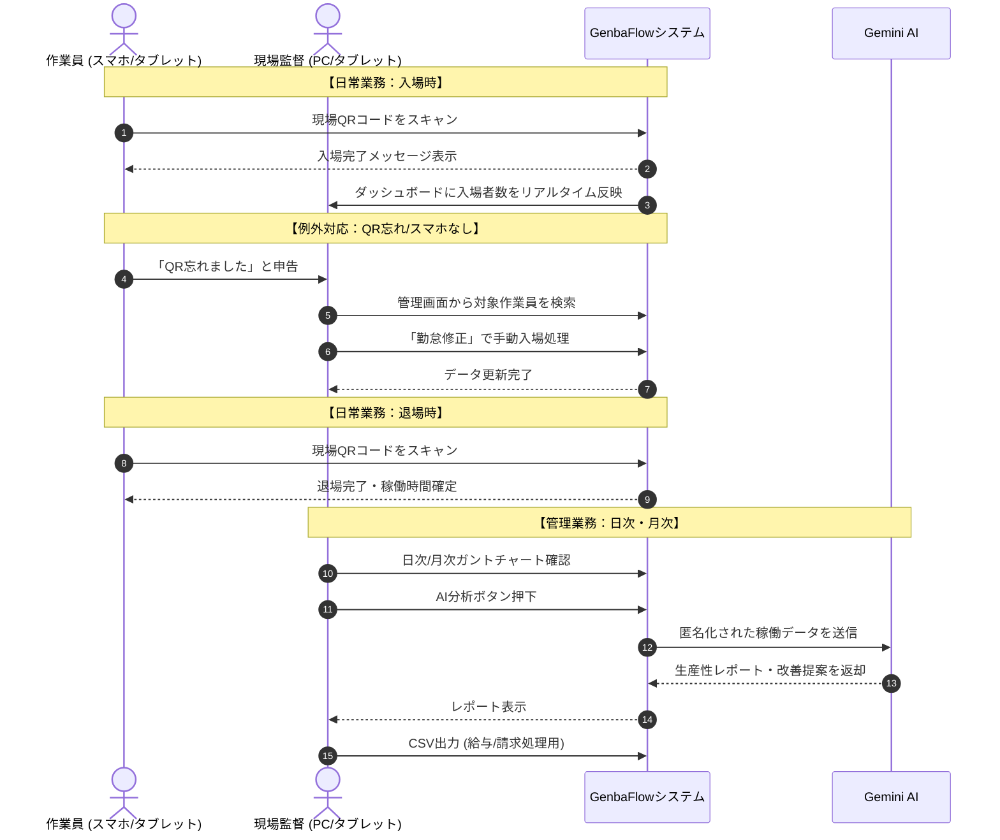

# 現場管理システム "GenbaFlow" 導入・運用計画書

**Project:** GenbaFlow Deployment
**Date:** 2025-05-20
**Target:** 現場監督、管理者、協力会社責任者

---

## 1. システム導入の目的

建設現場における「出面（でづら）管理」のデジタル化により、以下の課題を解決します。

*   **現状の課題:**
    *   紙の出勤簿や磁気カードによる集計のタイムラグ
    *   協力会社ごとの人工（にんく）計算の手間
    *   QRコード忘れやカード紛失時の対応の煩雑さ
    *   現場の稼働状況がリアルタイムに見えない

*   **GenbaFlowによる解決:**
    *   **リアルタイム可視化:** QRスキャンで即座にダッシュボードへ反映
    *   **工数自動集計:** 現場・会社・作業員ごとの稼働時間を自動計算
    *   **柔軟な運用:** QR忘れにも対応可能な管理画面編集機能
    *   **AI分析:** Gemini AIによる生産性レポートと改善提案

---

## 2. 全体運用フロー概要

現場での日常的な運用フロー（作業員と管理者の動き）を図解します。



---

## 3. 運用詳細：役割ごとのアクション

### A. 作業員（協力会社）
**アクション:** 自身のスマートフォン、または現場設置のタブレットでQRコードを読み取るだけです。

*   **入場時:** アプリ（Web）を開き、「QRスキャン」→ 現場QRを読み取り → 「入場する」
*   **退場時:** アプリ（Web）を開き、「QRスキャン」→ 現場QRを読み取り → 「退場する」

### B. 現場監督・管理者
**アクション:** PCまたはタブレットで全体の状況をモニタリングし、例外対応を行います。

1.  **ダッシュボード確認**
    *   本日の総入場者数、現場ごとの稼働状況をリアルタイム確認。
    *   「現場別日次サマリー」で、どの現場にどれくらい人員が割かれているか把握。
2.  **出面表（ガントチャート）の確認**
    *   「日次」ビュー：誰が何時から作業しているか、作業中/退場済のステータス確認。
    *   「月次」ビュー：月間の出勤日数確認。
3.  **【重要】修正・手動登録（QR忘れ対応）**
    *   出面表の該当作業員の行をクリック（またはタイムラインをクリック）。
    *   「勤怠修正モーダル」にて、時間と現場を指定して保存。
    *   *※ 削除機能もあるため、誤打刻の訂正も可能です。*

---

## 4. システム構成図

GenbaFlowはクラウドベースで動作し、Gemini APIを活用して高度なデータ処理を行います。

```mermaid
graph TD
    subgraph "現場 (On-Site)"
        Smartphone[作業員スマホ]
        Tablet[現場設置タブレット]
    end

    subgraph "管理・事務所 (Office)"
        PC[管理者PC]
    end

    subgraph "GenbaFlow Cloud"
        UI[Frontend App (React/Zustand)]
        Store[State Management]
        Logic[Business Logic]
    end

    subgraph "External Services"
        Gemini[Google Gemini AI]
        DB[(Database / Mock)]
    end

    Smartphone -->|QR Scan| UI
    Tablet -->|QR Scan| UI
    PC -->|Dashboard/Edit| UI

    UI --> Store
    Store --> Logic
    Logic -->|Mock Data Gen / Analysis| Gemini
    Logic -->|Persist Data| DB

    note1[データの即時同期<br>Zustandによる状態管理]
    note2[AIによる<br>シミュレーション・分析]

    style Gemini fill:#f9f,stroke:#333,stroke-width:2px
    style UI fill:#bbf,stroke:#333,stroke-width:2px
```

---

## 5. AI分析機能の活用について

単なる集計だけでなく、Gemini AIを用いて以下の付加価値を提供します。

*   **生産性レポート:** 過去のデータを分析し、作業時間の偏りや残業傾向を可視化。
*   **人員配置の最適化:** 職種ごとの稼働率から、不足しているリソースや過剰配置を指摘。
*   **シミュレーション:** （デモ機能）将来の工程における人員配置シミュレーションデータの生成。

---

## 6. 今後のロードマップ

1.  **フェーズ1（今回リリース）:**
    *   QR出退勤、ガントチャート表示、手動修正機能、CSV出力
2.  **フェーズ2（予定）:**
    *   GPS打刻機能（QRコード不要エリア向け）
    *   入場時の顔認証オプション
    *   安全書類（グリーンファイル）との連携
3.  **フェーズ3（予定）:**
    *   AIによる工事進捗予測とアラート機能

---

## 7. よくある質問 (FAQ)

*   **Q: 電波が悪い現場でも使えますか？**
    *   A: 現状はオンライン必須ですが、将来的にはオフライン一時保存機能を追加予定です。
*   **Q: ガラケーの作業員はどうすればいいですか？**
    *   A: 現場監督が「管理画面」から手動で「入場処理」を行うことで対応可能です。
*   **Q: データの保存期間は？**
    *   A: クラウド上に無期限で保存され、いつでも過去の月次データをCSV出力可能です。
